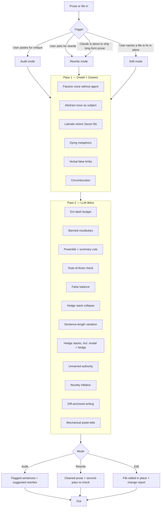

# plain-english

There are a few seminal texts on coherent and clear writing in the English language. Two that I particularly like are:

1. George Orwell's essay on communication and writing in politics
2. A book written in 1948 for civil servants, and then published with a follow-up

Both of them have a very clear set of rules for stripping flab and keeping focused when writing. There's an argument over whether using them strips some beauty, but I've been using variants of these in my dealings with LLMs for the last three years, and you definitely get improved copy. We all know the tendency of LLMs to produce slop. There are patterns that you notice if you're in the weeds that aren't just ChatGPT's insane use of bullet points and numbering. There's also these lists of patterns and repetitions and argument structuring. There are various ways of beating this. You can voice-pick fingerprint yourself and add in a lot of anti-patterns, but I wanted to pull together a skill that helps create writing that doesn't necessarily feel like LLM slop.

## What the skill does

It runs two passes over prose. The first pass is the classical one. The second is the LLM-specific one. They stack, because the problems stack: bad writing was bad before LLMs, and LLMs added their own dialect on top.

It works in three modes. In **audit mode**, you paste prose and get back marked-up flags with suggested rewrites. In **rewrite mode**, you get back the cleaned version, with a few notes on what changed if you asked for them, plus a silent second pass that re-checks the rewrite before it's returned. In **edit mode**, you name a file and Claude makes minimal, targeted edits in place rather than handing back a copy. Claude can also call rewrite mode on its own drafts before delivering long-form prose, so the output arrives already cleaned up.

## The patterns it catches

### Pass 1 — classical bloat (Orwell + Gowers)

- Passive voice with no named agent
- Abstract nouns sitting as the subject of a sentence
- Latinate padding where Saxon would do (*utilise* → *use*, *facilitate* → *help*, *prior to* → *before*)
- Dying metaphors (*toe the line, Achilles' heel, at the end of the day*)
- Verbal false limbs (*make contact with* → *call*, *exhibit a tendency to* → *tend to*)
- Circumlocution (*due to the fact that* → *because*)

### Pass 2 — LLM tics

- Em-dash overuse. LLMs run 15–25 per 1000 words. Human prose runs 3–5.
- Banned vocabulary: *delve, tapestry, navigate, leverage, landscape, ecosystem, realm, multifaceted, foster, underscore, robust, comprehensive, nuanced, paramount, crucial, holistic, pivotal*.
- Preamble openers: *That's a great question, Certainly, I'd be happy to.*
- Summary closers: *In conclusion, To sum up, I hope this helps.*
- Reflex rule-of-three. Lists default to exactly three points whether the content has two, three, or four.
- The pivot construction: *It's not just X, it's Y.*
- False balance. *On one hand... on the other...* even when one hand clearly wins.
- Sycophantic openers and the "helpful assistant" voice bleeding into authored prose.
- Hedge stacks, including the modal form. *I genuinely think it's worth noting that this may, in some sense, arguably represent...*, *this could potentially unlock...*
- Unnamed authority. *Experts believe, studies show* — with no one named.
- Novelty inflation. Treating an applied idea as an invention, or dropping an undefined coined term.
- Diff-anchored writing. Docs that narrate the edit instead of describing the current state.
- Mechanical paste-tells. Unfilled placeholders, chat-tool citation markup, AI-tool URL tracking params.

## The ethos

Orwell published *Politics and the English Language* in 1946. The argument was political. Bad writing makes bad thought possible, and bad thought serves bad politics. He gave six rules and four categories of disease (dying metaphors, verbal false limbs, pretentious diction, meaningless words). The sixth rule is the saving clause: break any of these rules sooner than say anything outright barbarous.

Sir Ernest Gowers wrote *Plain Words* in 1948 for the British civil service, and a follow-up called *The ABC of Plain Words* in 1951. Gowers' golden rule: "the first law of writing is that the words employed should be such as to convey to the reader the meaning of the writer." Everything else is subordinate to that. He attacked officialese the way Orwell attacked political language — same disease, different costume.

The argument against this tradition is that stripped prose loses beauty. Sometimes it does. Orwell's sixth rule covers it. Clarity wins, but never at the cost of the line that actually sings. The skill is opinionated, not absolutist. If breaking a rule produces a better sentence, break the rule.

## What problem it solves

LLM output has a recognisable shape. Once you've seen it you can't unsee it. The em-dashes, the rule-of-three, the *delve into the nuanced tapestry of...*, the preamble before the answer, the summary after it, the hedges that erase whatever claim was supposedly being made. Most people who use LLMs at scale either learn to post-edit by hand, build their own anti-pattern list, or just publish slop.

This skill is the anti-pattern list, codified, plus the older tradition that LLMs collectively forgot. Claude reads it, applies it, and the prose stops sounding like every other model on the internet.

## How it works



## Install

```
git clone https://github.com/b1rdmania/claude-plain-english-skill.git ~/.claude/skills/plain-english
```

## Trigger phrases

*plain English, tighten this, make this clearer, cut the AI voice, rewrite plainly, fix the writing, detox this.*

Also runs as a self-audit on long-form output (essays, blog posts, articles, reports, documentation).

## Sources

- George Orwell, *Politics and the English Language* (1946)
- Sir Ernest Gowers, *Plain Words* (1948)
- Sir Ernest Gowers, *The ABC of Plain Words* (1951)
- Research on LLM writing tics across Claude, GPT-4, Gemini, Llama (2024–2026)

## License

MIT
